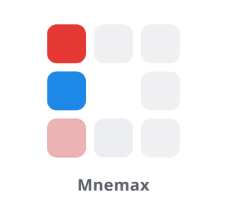

<div align="center">

<picture>
  <source media="(prefers-color-scheme: dark)" srcset="docs/images/splash-dark.gif">
  
</picture>

**A memory training game for desktop and mobile devices.**

The name was inspired by the ancient Greek word *mnēmē* (μνήμη), which means memory.

[How to play](#how-to-play) · [Getting started](#getting-started) · [Android debugging](#debugging-on-an-android-device) · [Building](#building-releases) · [Reporting issues](#reporting-issues)

</div>

---

## About

Mnemax is a brain-training game which can help improve your memory. Things appear one after
another, and you press a button whenever the current one matches the one from **N** steps ago. You can
track up to four things (streams) at once: position of the box, its color, its number or a spoken letter. Tracking
two of them together is known as *dual n-back*.

The app is built with [Tauri v2](https://v2.tauri.app/), React and TypeScript, so the same code runs as a
desktop app (Linux, Windows, macOS) and a mobile app (Android, iOS). Everything stays on your device.
There are no accounts, no network requests, no tracking and it's freeee! 🤑

### How to play

1. A round has **20 trials**. In each trial, a box lights up in one of the 8 outer cells of a 3×3 grid.
   Depending on your settings, the box can also have a **color** and a **number**, and a **letter** is
   spoken aloud.
2. Each of these is a *stream*. When the current trial matches the trial from **N** steps back on a
   stream, press that stream's button.
3. If a stream doesn't match, don't press anything for it. Pressing when there's no match counts
   against you, just like missing a match.
4. Lastly, remember! No cheating ;) 
   A round always counts. If you stop it early, or you close the app in the middle of the round, it's still saved, with a
   score of 0. So quitting a round that's going badly doesn't keep it out of your stats. To play without
   saving anything, use practice mode.

**Example:** with N = 2 and the Position and Letter streams on, press **Position** when the current highlighted box is in
the same cell as two trials ago, and press **Letter** when you hear the same letter as two trials ago.

| Stream   | What to remember               | Default key |
| -------- | ------------------------------ | ----------- |
| Position | Which cell the box lights up in | `F`         |
| Color    | The box's color                | `D`         |
| Number   | The number shown in the box    | `J`         |
| Letter   | The spoken letter              | `K`         |

On desktop, `Space` starts, pauses and resumes a round, and `Esc` stops it. You can change the keys in
**Settings → Keyboard**.

### Features

- **Pick your streams:** any combination of Position, Color, Number and Letter. Position + Letter is
  classic dual n-back.
- **Adjust the difficulty:** N from 1 to 10, five speeds (from Very slow, 3 seconds per trial, to Very fast,
  0.8 seconds and how many matches each stream has per round).
  > **_Tip:_** You can do that in the settings or in the play view from the quick settings HUD at the top.
- **Scoring:** accuracy counts both the matches you caught and the non-matches you correctly left
  alone. Pressing randomly scores 0.
- **Progress tracking:** every round gets a *level score*, which is difficulty × accuracy, so rounds
  played with different settings can be compared. For example, a perfect dual 2-back round at Normal
  speed scores 2. The Stats screen also shows results per setup, an activity calendar, time played
  against level, and every past round trial by trial.
- **Daily target:** set how many minutes you want to play each day and see if you reached it.
- **Backup:** export your rounds to a JSON file and import them again, for example on another device.
- **Keeps timing accurate:** buttons respond the moment you press them rather than when you let go, and
  a round pauses by itself when you switch away from the app.

## Platform support

| Platform | Status                                |
| -------- | ------------------------------------- |
| Linux    | ✅ Developed and tested               |
| Android  | ✅ Developed and tested               |
| Windows  | ⚠️ Not tested                         |
| macOS    | ⚠️ Not tested                         |
| iOS      | ⚠️ Not tested                         |

> [!NOTE]
> I don't have a Mac, iPhone or a Windows device, so I can't test Mnemax on them. Tauri supports all
> of them, so the app will likely work as it is. If you try it and something breaks or looks wrong,
> please [open an issue](https://github.com/Derbakias/Mnemax/issues/new/choose) using the bug report template. Reports and fixes for
> these platforms are very welcome.

## Tech stack

- **App shell:** [Tauri v2](https://v2.tauri.app/) (Rust), with its `store`, `dialog` and `fs` plugins
- **Interface:** React 19 and TypeScript, built with Vite, styled with plain CSS (no UI framework for now)
- **Charts:** [uPlot](https://github.com/leeoniya/uPlot) and inline SVG
- **Icons:** [Ionicons](https://ionic.io/ionicons)
- **Tests:** [Vitest](https://vitest.dev/) for the game logic, stats and storage, and `cargo test` for the
  Rust code

## Project structure

```text
Mnemax/
├── index.html                 # The page Vite loads
├── src/                       # The app interface (React + TypeScript)
│   ├── main.tsx               # Starts React
│   ├── App.tsx                # Startup screen, tab bar and the three screens
│   ├── index.css              # All styles, including light and dark themes
│   ├── screens/               # Play, Stats and Settings
│   ├── components/            # Grid, answer buttons, charts, loader..
│   ├── game/                  # Game logic, independent of React
│   │   ├── config.ts          #   constants, speed presets, settings limits
│   │   ├── generator.ts       #   builds each round's sequence with the right number of matches
│   │   ├── engine.ts          #   runs a round: timing, answers, pause/resume
│   │   ├── scoring.ts         #   marks each answer and calculates accuracy
│   │   └── __tests__/
│   ├── levels.ts              # Difficulty and level score
│   ├── stats.ts               # Stats calculations
│   ├── stats-io.ts            # JSON import and export
│   ├── prefs.ts               # App preferences (keys, button layout, daily target)
│   ├── settings-context.tsx   # Shares settings across the app
│   ├── storage.ts, kv.ts      # Saving data (Tauri store, or localStorage in a browser)
│   ├── speech.ts              # Plays the letter sounds
│   ├── assets/letters/        # Recorded letter sounds (WAV)
│   └── __tests__/
├── src-tauri/                 # Native part of the app (Rust)
│   ├── src/lib.rs             # Plugin setup, moves data over from older versions of the app
│   ├── tauri.conf.json        # Window, packaging and security settings
│   ├── capabilities/          # What the interface is allowed to access
│   ├── icons/                 # App icons for every platform
│   └── gen/android/           # Android project (Gradle)
├── scripts/                   # Release build (build-release.mjs) and branch name check
├── public/                    # Files served as they are (favicon)
├── assets/                    # App icon source files (see Changing the app icon)
├── docs/images/               # Images used in this README
├── MAINTAINING.md             # Pull requests, releases and repository setup, for the maintainer
└── .github/                   # Issue forms, CI and release workflows, Dependabot
```

## Getting started

### Prerequisites

- **Node.js** 20.19 or newer (or 22.12+)
- **pnpm**, the package manager this project uses. See the [install guide](https://pnpm.io/installation),
  or run `npm install -g pnpm`. The exact pnpm version is pinned in `package.json`, and pnpm switches to
  it by itself.
- **Rust** (stable), installed with [rustup](https://rustup.rs/)
- The **system libraries Tauri needs** on your OS. See the
  [Tauri prerequisites guide](https://v2.tauri.app/start/prerequisites/). On Debian or Ubuntu:

  ```bash
  sudo apt install libwebkit2gtk-4.1-dev build-essential curl wget file \
    libxdo-dev libssl-dev libayatana-appindicator3-dev librsvg2-dev
  ```

### Install and run the tests

```bash
git clone https://github.com/Derbakias/Mnemax.git
cd Mnemax
pnpm install

pnpm test                      # game logic, stats and storage tests
pnpm typecheck                 # checks the TypeScript types
(cd src-tauri && cargo test)   # Rust tests
```

### Run the app in development mode

```bash
pnpm desktop
```

This opens the app in a desktop window. When you save a change to the interface code, the window updates
straight away. When you change the Rust code, the app rebuilds and restarts by itself.

To work on the interface in a normal web browser instead, run `pnpm dev` and open
`http://localhost:1420`. In the browser, data is saved in `localStorage`, and export/import use the
browser's download and file picker instead of the native dialogs.

## Android

### Setup

You need:

- The Android SDK (including `adb`) and the NDK, for example installed through Android Studio
- JDK 17 or newer
- The Rust targets for Android:

```bash
rustup target add aarch64-linux-android armv7-linux-androideabi i686-linux-android x86_64-linux-android

export ANDROID_HOME=$HOME/Android/Sdk
export NDK_HOME=$ANDROID_HOME/ndk/<version>
export JAVA_HOME=<path to JDK 17+>
```

The Android project is already in the repo (`src-tauri/gen/android`), so you don't need to run
`tauri android init`. The app is locked to portrait mode, and `MainActivity.kt` keeps the content clear of
the phone's status and navigation bars.

### Debugging on an Android device

Connect your phone over USB with **USB debugging** turned on (`adb devices` should list it), then run:

```bash
adb reverse tcp:1420 tcp:1420
adb reverse tcp:1421 tcp:1421
pnpm android --host 127.0.0.1
```

What these commands do:

- In development, the app on your phone loads its interface from the dev server on your computer.
- `adb reverse` connects ports on the phone to the same ports on your computer over the USB cable:
  1420 is the dev server and 1421 is the live-reload connection. This means you don't need Wi-Fi, the
  same network, or any firewall changes.
- `--host 127.0.0.1` tells the app to load from that address, which now leads to your computer.

Run the two `adb reverse` commands again each time you reconnect the phone or restart `adb`.

**Useful tools while debugging:**

- To see the console, page elements and network requests, open `chrome://inspect/#devices` in Chrome or
  Chromium on your computer while the app is running and click `inspect`.
- For Android's own logs, run `adb logcat`.

With an Android emulator, `pnpm android` on its own is usually enough.

## Building releases

Making a release (setting the version, tagging, and publishing the files built by GitHub) is described
in [MAINTAINING.md](MAINTAINING.md). The sections below are for building the release files on your own
computer.

### Changing the app icon

The icon is drawn as SVG in `assets/`:

- `icon.svg` is the main icon, used for Linux, Windows, macOS and iOS.
- `icon-android-foreground.svg` is the Android version. Android phones cut app icons into different
  shapes (circle, rounded square, …), so this version is smaller and has no background. The white
  background color is set in `icon.json`.

After changing either file, run:

```bash
pnpm icons
```

This regenerates every icon size in `src-tauri/icons/` (and the Windows `.ico` and macOS `.icns` files)
and in the Android project. For iOS, run it again after `pnpm tauri ios init`, so the iOS project gets the
icon too. The browser tab icon, `public/favicon.png`, is a 64×64 copy of `icon.svg` and is updated by hand.

### Release file names

`pnpm desktop:build` and `pnpm android:build` run the normal Tauri build, then copy the finished
files into a `release/` folder with names ready to attach to a GitHub release, in the form
`Mnemax-<version>-<architecture>.<extension>`:

```text
release/
├── Mnemax-0.1.0-x64.AppImage
├── Mnemax-0.1.0-x64.deb
├── Mnemax-0.1.0-x64.rpm
├── Mnemax-0.1.0-universal.apk   # all phone types
└── Mnemax-0.1.0-arm64.apk       # 64-bit ARM only
```

The version comes from `package.json`. `release/` is gitignored, so these files are never committed.
Tauri's own copies stay in their usual places (`src-tauri/target/release/bundle/` and
`src-tauri/gen/android/app/build/outputs/apk/`). The script that does this is `scripts/build-release.mjs`.

### Linux

```bash
pnpm desktop:build
```

This makes an AppImage, a `.deb` (Debian, Ubuntu, …) and an `.rpm` (Fedora, openSUSE, …). To build just
one format, add `--bundles`. For example, `pnpm desktop:build --bundles appimage`.

The AppImage includes GStreamer, the media framework that plays the letter sounds, so audio works on any
distribution. That's also why it's much bigger than the other two.

### Android

```bash
pnpm android:build                        # one APK for all phone types (larger)
pnpm android:build --target aarch64       # 64-bit ARM only, which covers most phones (smaller)
```

For a quick test build that doesn't need a signing key, run
`pnpm tauri android build --debug --apk --target aarch64`. It's saved as
`src-tauri/gen/android/app/build/outputs/apk/arm64/debug/app-arm64-debug.apk` and isn't copied to
`release/`.

To install an APK on a connected phone, run `adb install -r <path to the apk>`.

#### Signing

Android refuses to install an APK that isn't signed. Debug builds are signed automatically with a debug
key. Release builds need your own key, set up like this:

1. Create a key `keytool` comes with the JDK. It asks for a password. If it also asks for a separate key
   password, use the same one, because the setup below uses one password for both.

   ```bash
   mkdir -p ~/android-keys
   keytool -genkey -v -keystore ~/android-keys/mnemax-release.jks -keyalg RSA -keysize 2048 -validity 10000 -alias mnemax
   ```

2. Create `src-tauri/gen/android/keystore.properties`:

   ```properties
   storeFile=/home/<you>/android-keys/mnemax-release.jks
   keyAlias=mnemax
   password=<your key password>
   ```

`keystore.properties` is listed in `.gitignore`. **Never commit it or your key file.** Without it, release
builds are unsigned (the file name ends in `-unsigned.apk`) and phones won't install them. For more, see
the [Tauri Android signing guide](https://v2.tauri.app/distribute/sign/android/).

### Windows, macOS, iOS

These should work with the standard Tauri commands, but they haven't been tested
(see [Platform support](#platform-support)):

- **Windows or macOS:** run `pnpm desktop:build` on that system
- **iOS:** you need a Mac with Xcode. Run `pnpm tauri ios init` once, then `pnpm tauri ios dev` to try it
  or `pnpm tauri ios build` to build it.

## Data and privacy

Your rounds and settings are saved only on your device, in a file called `mnemax.json` in the app's data
folder. Nothing is sent anywhere. To back up your rounds or move them to another device, use
**Settings → Data → Export JSON**, then **Import JSON** on the other device.

> Note: I'll implement soon a faster way to share the stats locally across the devices.

## Reporting issues

Found a bug or have an idea? [Open an issue](https://github.com/Derbakias/Mnemax/issues/new/choose) and pick a template:

- **Bug report:** tell us your system and its version, how you installed the app, and the steps that
  cause the problem. If it's about how something looks, please add a **screenshot or screen recording**.
- **Feature request:** suggest something new or an improvement.

Reports from **Windows, macOS and iOS** users are especially helpful, since I can't test those
platforms myself.

## Contributing

Pull requests are welcome. Before you open one, make sure you've followed the
[Getting started](#getting-started) steps and run the tests to check that everything passes:

```bash
pnpm test && pnpm typecheck && (cd src-tauri && cargo test)
```

Git hooks run most of these for you. `pnpm install` sets them up (with [husky](https://typicode.github.io/husky/)):

- **Before each commit:** `pnpm typecheck` and `pnpm test`, which take a few seconds.
- **Before each push:** `cargo test`, but only if the push changes Rust code in `src-tauri/`, because
  compiling the Rust tests can take a while.

If a check fails, the commit or push is stopped so you can fix the problem first. The same checks run
again on GitHub for every pull request (the **CI** workflow), and a pull request can only be merged once
they pass.

Make your changes on a branch named after the kind of change: `feature/` for new features and
improvements, `fix/` for bug fixes, `docs/` for documentation, or `chore/` for tooling and other
maintenance, followed by lowercase words joined by hyphens (for example `fix/android-audio`). Pull
requests from other branch names fail the checks.

Give your pull request a title that describes the change for users (for example, "Fix letter audio
cutting off on Android"). Pull requests are squash-merged, so the title becomes the commit on `main`
and a line in the release notes.

Please don't change the version number in pull requests. It's updated when a release is made (see
[MAINTAINING.md](MAINTAINING.md)).

## Credits

The spoken letters are recorded sound files, because Android and many Linux systems don't provide a
built-in text-to-speech voice to web apps. They were generated with [Piper](https://github.com/rhasspy/piper)
using the `en-us-libritts-high` voice (speaker 0), then trimmed and volume-matched with sox. The voice
was trained on [LibriTTS](http://www.openslr.org/60/), which is licensed under [CC BY 4.0](https://creativecommons.org/licenses/by/4.0/).

## License

Mnemax is free software, licensed under the
[GNU Affero General Public License v3.0 or later](LICENSE) (AGPL-3.0-or-later).

You can use, study, share and change it. If you share the app or a changed version of it, or run a
changed version as an online service, you must make the source code available under the same license.
